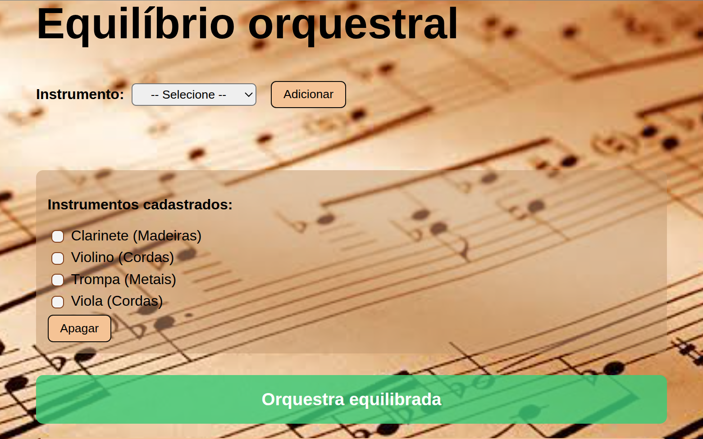

# Equilíbrio Orquestral



##  Por que esse projeto foi criado?

O sistema **Equilíbrio Orquestral** foi desenvolvido a partir da necessidade de organizar de forma mais eficaz o ingresso de novos músicos na orquestra da instituição religiosa onde leciono.

Nas igrejas de maior porte, temos uma orquestra completa, enquanto nas igrejas menores há uma formação mais reduzida. No entanto, para garantir uma sonoridade voltada ao estilo erudito, é fundamental manter o **equilíbrio entre as famílias de instrumentos** (cordas, madeiras e metais) no momento da admissão de novos integrantes.

De acordo com o manual que seguimos:

* Os candidatos devem ser inseridos em grupos de quatro.
* A proporção ideal é:

  * **50% cordas**
  * **25% madeiras**
  * **25% metais**

Este sistema ajuda a visualizar rapidamente o impacto de novos ingressantes na formação da orquestra, auxiliando professores e coordenadores a manterem o equilíbrio proposto.

---

## 🚀 Tecnologias utilizadas

* HTML5
* CSS3
* JavaScript (puro, sem frameworks)

---

## 🔧 Como rodar o projeto localmente

### 1. Clonar o repositório

Se você já tem o Git instalado, basta abrir o terminal e rodar:

```bash
git clone https://github.com/andersonsouza12/orchestral-balance.git
```

Depois entre na pasta clonada:

```bash
cd seu-repositorio
```

E abra o arquivo `index.html` em seu navegador.

---

### 2. Caso não tenha o Git instalado

Siga os passos abaixo para instalar o Git em seu sistema:

#### Para Windows:

1. Acesse: [https://git-scm.com/download/win](https://git-scm.com/download/win)
2. O download iniciará automaticamente.
3. Execute o instalador e avance com as opções padrão.

#### Para Ubuntu/Linux:

```bash
sudo apt update
sudo apt install git
```

#### Para macOS:

Instale o Git com o Homebrew:

```bash
brew install git
```

Se ainda não tem o Homebrew, instale com:

```bash
/bin/bash -c "$(curl -fsSL https://raw.githubusercontent.com/Homebrew/install/HEAD/install.sh)"
```

Ou acesse: [https://brew.sh](https://brew.sh)

---

## 🌍 Acessando o projeto

Após clonar e abrir o `index.html`, você poderá interagir com a interface para:

* Adicionar instrumentos
* Visualizar sugestões de formação
* Verificar se a orquestra está equilibrada
* Remover instrumentos selecionados

---

## 📄 Observações finais

Esse projeto foi pensado para facilitar o trabalho de professores de música e coordenadores em ambientes religiosos com orquestras, trazendo uma forma intuitiva e visual de organizar os músicos segundo critérios pedagógicos e sonoros.

---